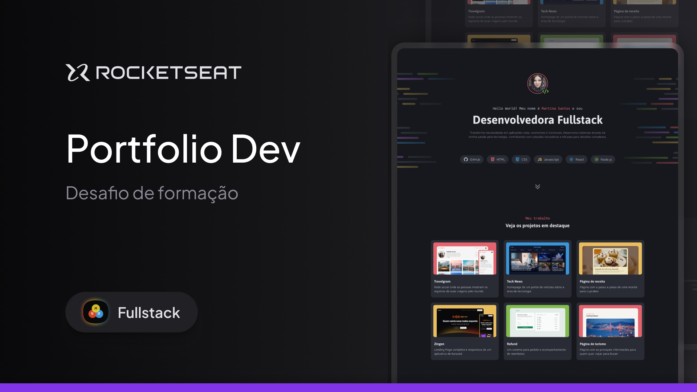

<h1 align="center"> Portfolio Dev </h1>

Programa feito no quadro do curso Full-Stack da Rocketseat.  

 

  
  Imagem feita por <a href="https://www.linkedin.com/authwall?trk=bf&trkInfo=AQFe-pomZY0b6AAAAZeHtjIQGrD9koHn9OwTd5SK5NbJhw9VmaFQzE8IkVDUK9_J5RIxGvDZMtWaC3cI5y8ZZbM8SwQAzjrQeDyVve9xA7zjf-nqmF1gW2LDUlXWSi9oQVHgaqU=&original_referer=&sessionRedirect=https%3A%2F%2Fwww.linkedin.com%2Fin%2Fmillenakmartins%2F">Millena Martins</a>

## 🚀 Tecnologias

Esse projeto foi desenvolvido com as seguintes tecnologias:

- HTML e CSS
- Git e Github
- Figma

## 🖥️ Projeto

O projeto é um site desktop de portfólio para desenvolvedores, com links para projetos e contato do profissional. 
Esse é um dos desafios práticos da formação Fullstack, um dos conteúdos disponíveis para alunos da Rocketseat.  
